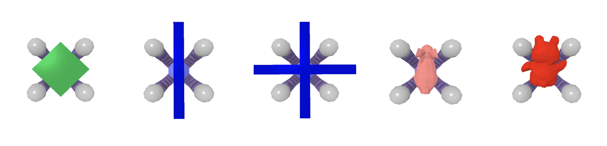
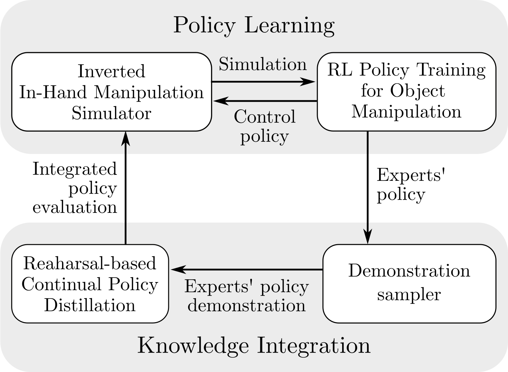
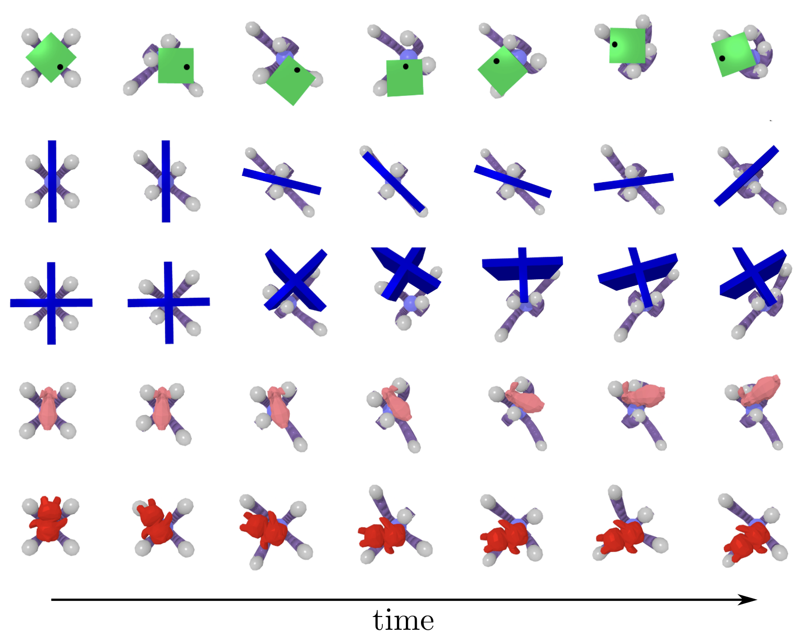
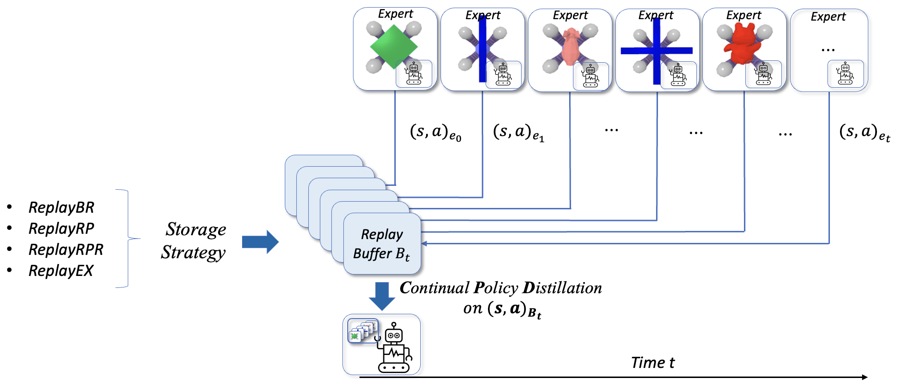
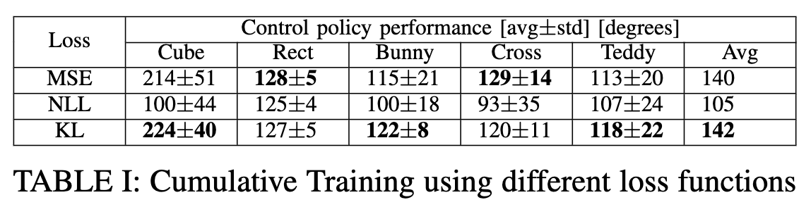
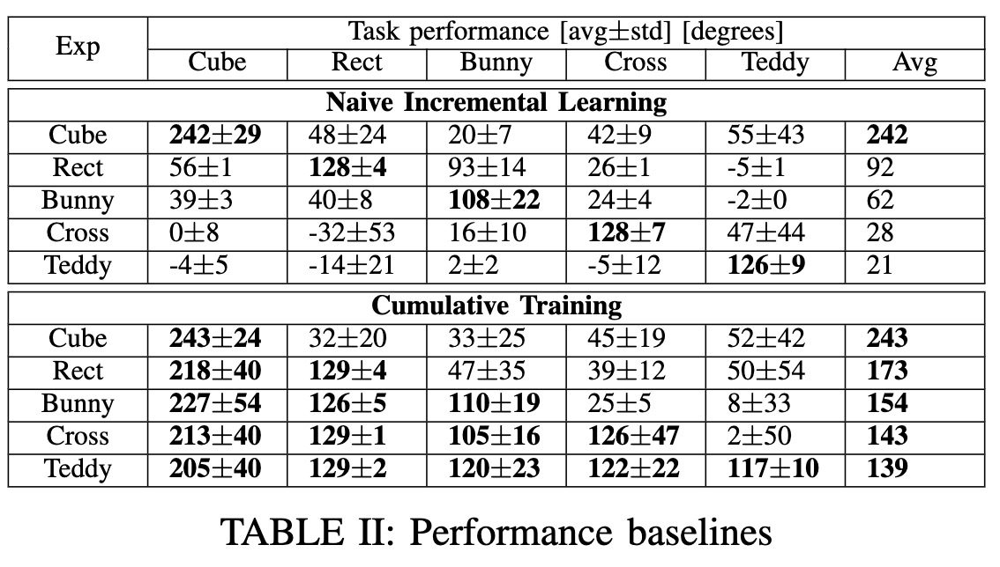
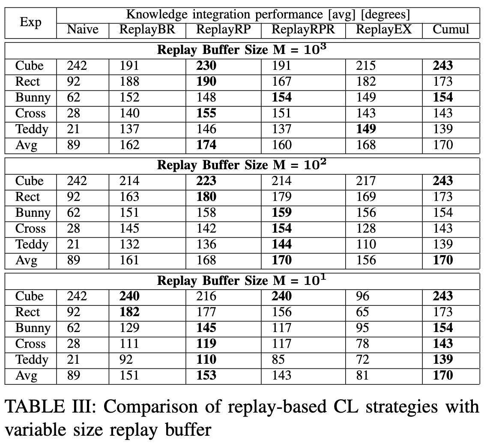

# Continual Policy Distillation of Reinforcement Learning-based Controllers for Soft Robotic In-Hand Manipulation

Dexterous manipulation, often facilitated by multi-fingered robotic hands, holds solid impact for real-world applications. Soft robotic hands, due to their compliant nature, offer flexibility and adaptability during object grasping and manipulation. Yet, benefits come with challenges, particularly in the control development for finger coordination. Reinforcement Learning (RL) can be employed to train object-specific in-hand manipulation policies, but limiting adaptability and generalizability. We introduce a Continual Policy Distillation (CPD) framework to acquire a versatile controller for in-hand manipulation, to rotate different objects in shape and size within a four-fingered soft gripper. The framework leverages Policy Distillation (PD) to transfer knowledge from expert policies to a continually evolving student policy network. Exemplar-based rehearsal methods are then integrated to mitigate catastrophic forgetting and enhance generalization. The performance of the CPD framework over various replay strategies demonstrates its effectiveness in consolidating knowledge from multiple experts and achieving versatile and adaptive behaviours for in-hand manipulation tasks. 

Objects used and their poses for In-Hand Manipulation:
<center>

</center>

The proposed CPD framework is established through a pipeline shown bellow, that involves recurrently learning a soft robotic hand controller in simulation for in-hand manipulation of a specific object, and its integration with the previously acquired knowledge to build a versatile controller. 
<center>

</center>

During Policy Learning, the expert’s control policy undergoes training using RL for in-hand re-orientation of an object. This process can be repeated for various objects, with a distinct expert trained for each. 
<center>

</center>

In Knowledge Integration, demonstrations of the experts’ policies are asynchronously sampled and employed for rehearsal-based continual policy distillation. This entails integrating the acquired knowledge from multiple experts into a unified policy. 

<center>

</center>

This work contributes to the advancement of soft robotic manipulation by integrating RL and CL. By addressing the catastrophic forgetting problem and integrating knowledge from multiple RL agents, the developed soft robotic hand controller enables versatile and adaptive behaviours, facilitating the effective deployment of soft robotic systems in various scenarios.

<center>

</center>

The approach offers advantages in terms of time efficiency, with significantly reduced training time compared to traditional online RL. By utilizing a limited-size memory buffer, memory efficiency is optimized while retaining important knowledge for learning.

<center>

</center>

Overall, CPD provides a practical and efficient sequential learning framework to address the challenge of knowledge integration in complex manipulation tasks. It contributes to the advancement of learning-based control strategies for soft robotic systems within the paradigm of CL. CPD holds promise for developing intelligent and adaptive soft robotic hand controllers that continually acquire and retain knowledge, enabling them to perform a wide range of tasks effectively in several applications.

<center>

</center>

## How to use:
1. Train an expert controller: 
```
python somo_rl/train_policy.py -e "InHandManipulationInverted-v0" -g "PPO_cube" -r "seed_0" -o
```
2. Generate demonstrations from the trained expert controller:
```
python somo_rl/post_processing/run_policy.py -e "InHandManipulationInverted-v0" -g "SAC" -r "seed_3" -m "best_model" --seed 103 -v -s -sv
```
4. Distill knowledge from expert demonstrations:
```
python somo_rl/continual_learning/behavior_cloning_avl_nothreshold.py -e1 "InHandManipulationInverted-nothreshold" -g1 "PPO_cube" -r1 "seed_1" -e2 "InHandManipulationInverted-nothreshold" -g2 "PPO_rect" -r2 "seed_6" -e3 "InHandManipulationInverted-nothreshold" -g3 "PPO_bunny" -r3 "seed_1" -e4 "InHandManipulationInverted-nothreshold"  -g4 "PPO_cross" -r4 "seed_0" -e5 "InHandManipulationInverted-nothreshold"  -g5 "PPO_teddy" -r5 "seed_6" --seed 101 -n 1 -stg Cumulative -nr 10
```
